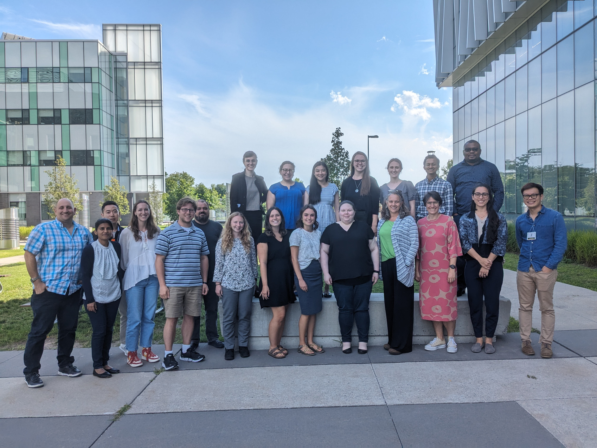

:::::: columns
::: {.column width="40%"}
The 9th Preparing for Careers in Teaching Statistics and Data Science Workshop
will be held at one of the hotels associated with the Joint Statistical 
Meetings [^1] on August 2, 2026, immediately following the [EAPOST workshop at Curry College](https://sites.google.com/view/eaapost/workshops).

The workshop is designed for graduate students and recent PhDs interested in
careers in teaching statistics and data science. Priority will be given to
graduate students who finished or will be finishing their program between Spring
2026 and Fall 2027.

This is a one-day workshop to prepare current and recent graduate students for a
future role as faculty responsible for teaching statistics and data science to
undergraduate students across a variety of disciplines. We envision workshop
participants become capable of developing innovative and pedagogically-sound
learning experiences for their students inside and outside the classroom and
using formative and summative assessment to guide their instructional practice.

:::

::: {.column width="5%"}
:::

::: {.column width="55%"}

:::
::::::

[^1]: Many thanks to Donna LaLonde at the ASA who generously sponsored our meeting room!

The ultimate objective of this workshop is to increase the proportion of
successful instructors who have the skills, capacity, and inclination to take on
the challenges of complex data-oriented teaching in twenty-first century. The
workshop also aims to promote interaction, networking, and community building
among recent and soon to be PhDs in statistics, data science, and relevant
fields who are interested in academic and teaching focused careers and to
provide them with valuable insights from leaders in the field. Topics include
teaching introductory statistics; teaching data science; teaching-focused career
opportunities; opportunities for grants; sharing resources and staying
connected. There will be opportunities for interaction and hands-on experience
with active learning and computing technologies.

If you have any questions, you can contact Allison Theobold at [atheobol\@calpoly.edu](mailto:atheobol@calpoly.edu) or Mine Çetinkaya-Rundel
at [mc301@duke.edu](mailto:mc301@duke.edu).

<!-- Claire Kelling at [ckelling\@carleton.edu](mailto:ckelling@carleton.edu) -->

This workshop is organized by the Section on Statistics and Data Science
Education of the American Statistical Association and is made possible with
support from the [EAPOST team](https://sites.google.com/view/eaapost/project-overview) and their [NSF DUE grant](https://www.nsf.gov/awardsearch/show-award?AWD_ID=2235355). 
